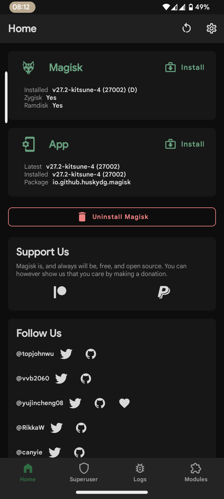
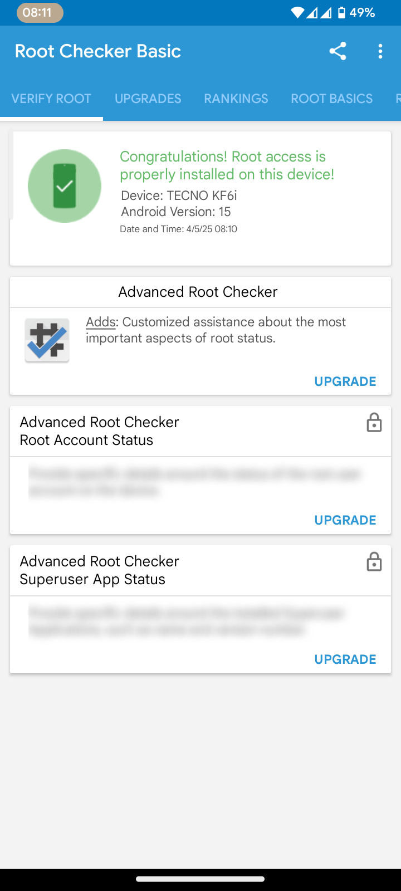

# Rooting Guide

## Why Would I Want Root?

Rooting essentially grants you Super User permissions, allowing you to perform advanced modifications on your Android device. This includes system-level debloating, major UI customizations, and more. While rooting has many perks, it also comes with downsides, such as:

- Voiding your warranty.
- Losing SafetyNet and Play Integrity compatibility.
- Losing access to certain banking applications.

Fortunately, there are workarounds for these issues.

---
## 🔍 Proof of Modifications
<div align="center">
  <table>
    <tr>
      <td align="center"><strong>Magisk Root</strong></td>
      <td align="center"><strong>Root Verified</strong></td>
    </tr>
    <tr>
      <td></td>
      <td></td>
    </tr>
    <tr>
      <td align="center">Zygisk enabled (v27.2)</td>
      <td align="center">Root access confirmed</td>
    </tr>
  </table>
  <em>Tecno KF6i (Android 15)</em>
</div> 

---
## Where Do I Start?

Before proceeding, ensure you have the following:

1. A **computer**.
2. Your device's [**firmware zip file**](google.com) downloaded and extracted.
4. An **unlocked bootloader**.(google is your friend - how to unlock bootloader for ******)

**Important:** Do not skip steps 2 and 3!

---

## Steps to Follow

### Step 1: Download Magisk
- Download the latest stable version of [**Magisk**](https://github.com/topjohnwu/Magisk) from the official repository.

### Step 2: Extract Boot and vbmeta Images
- Locate the `boot.img` file inside your device's firmware zip file.
- Also, find the `vbmeta.img` file in the firmware. This is required to disable **verity** and **boot verification**.

### Step 3: Patch the Boot Image
1. Transfer the `boot.img` file to your device.
2. Open the **Magisk** application on your device.
   - **Note:** The boot image must be patched on the same device it will be flashed into. For example, patch the `Tecno Spark 7 boot.img` on a Tecno Spark 7 device.
3. Tap the **Install** button and select the file for patching.
4. Locate and select your `.img` file.
5. Once the patching process is complete, the patched file will be saved in your **Downloads** folder.

### Step 4: Prepare Files for Flashing
- Copy the patched boot image (e.g., `patchedboot.img`) from your device's Downloads folder to your computer.
- Also, copy the `vbmeta.img` file from your firmware to your computer.
- Place both files in a single folder on your computer.

### Step 5: Flash the Images
1. Open a terminal in the folder containing the image files.
2. Connect your device to the computer via USB.
3. Reboot your device into bootloader mode by running:
   ```bash
   adb reboot bootloader
   ```
4. You must run the AVB disabling command before and after the boot image flashing command to avoid bootlooping:
   ```bash
   fastboot --disable-verity --disable-verification flash vbmeta vbmeta.img
   ```
5. Now run:
   ```bash
   fastboot flash boot patchedboot.img
   ```
6. Run the AVB command again:
   ```bash
   fastboot --disable-verity --disable-verification flash vbmeta vbmeta.img
   ```
7. Finally, reboot your device:
   ```bash
   fastboot reboot
   ```

With all that done, you should be booted with Magisk properly installed.

---

## Issues and Their Solutions with Magisk (FAQs)

### I updated Magisk and now Zygisk doesn't work.
Uninstall/restore the previous **Zygisk-compatible** version of the Magisk app, re-patch the stock boot image, and repeat the flashing process.

---

### I flashed a newly patched image, but my device doesn't boot.
Run the **disable verity command** before and after flashing a patched boot image for safety measures! If you still can't boot, flash your stock `boot.img` and try another version of the Magisk app for the patching process.

---

### I flashed a Magisk module, and now the device keeps rebooting. Please help!
1. Wait for the device to reboot. When the splash screen appears, wait 2 seconds and long-press **Volume Down** until the device boots.
2. This will boot the device into **Safe Mode**, disabling all third-party apps and Magisk modules.
3. From here, reboot back to the system, open Magisk, and remove the problematic module.
4. Reboot once more, and your device should work normally.
